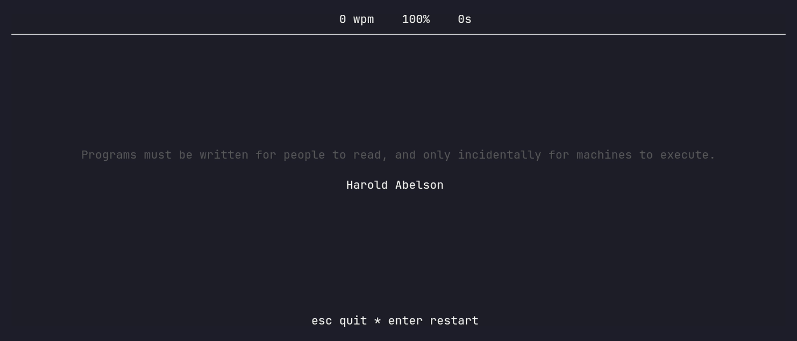

# SpellingGopher

A Monkeytype-style terminal typing game, written in Go



## Install

### Quick install (Linux / macOS)

```sh
curl -sSL https://raw.githubusercontent.com/Perchinka/SpellingGopher/main/install.sh | sh
```

Installs to `/usr/local/bin` (uses `sudo` only if that directory isn't writable).

### Homebrew (macOS / Linux)

```sh
brew install Perchinka/tap/spelling-gopher
```

### Linux packages

Download the matching file from the [latest release](https://github.com/Perchinka/SpellingGopher/releases/latest), then:

```sh
# Debian / Ubuntu
sudo dpkg -i spelling-gopher_*_linux_amd64.deb

# Fedora / RHEL
sudo rpm -i spelling-gopher_*_linux_amd64.rpm

# Arch / Manjaro
sudo pacman -U spelling-gopher_*_linux_amd64.pkg.tar.zst

# Alpine
sudo apk add --allow-untrusted spelling-gopher_*_linux_amd64.apk
```

### Quick install (Windows)

In PowerShell:

```powershell
irm https://raw.githubusercontent.com/Perchinka/SpellingGopher/main/install.ps1 | iex
```

Installs to `%LOCALAPPDATA%\Programs\spelling-gopher` and adds it to your user
`PATH` (override the location with `$Env:InstallDir`). Restart your terminal
afterwards so the new `PATH` takes effect.

Prefer to do it by hand? Download the matching
`spelling-gopher_*_windows_amd64.zip` (or `arm64`) from the
[latest release](https://github.com/Perchinka/SpellingGopher/releases/latest),
extract it, and place `spelling-gopher.exe` somewhere on your `PATH`.

### Go

```sh
go install github.com/Perchinka/SpellingGopher/cmd/spelling-gopher@latest
```

### From source

```sh
git clone https://github.com/Perchinka/SpellingGopher.git
cd SpellingGopher
go build -o spelling-gopher ./cmd/spelling-gopher
```

## Usage

```sh
spelling-gopher            # start a typing session
spelling-gopher --version  # print the installed version
```
