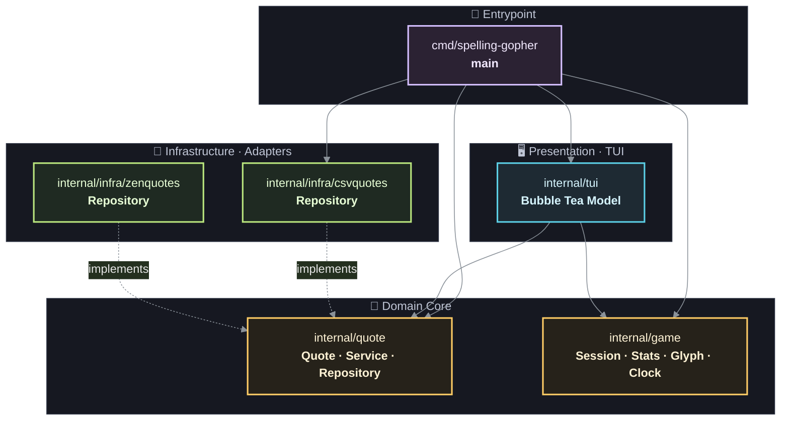
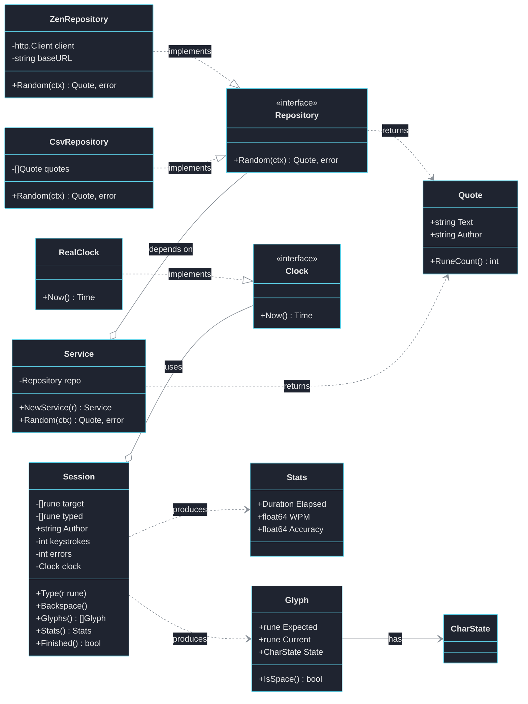
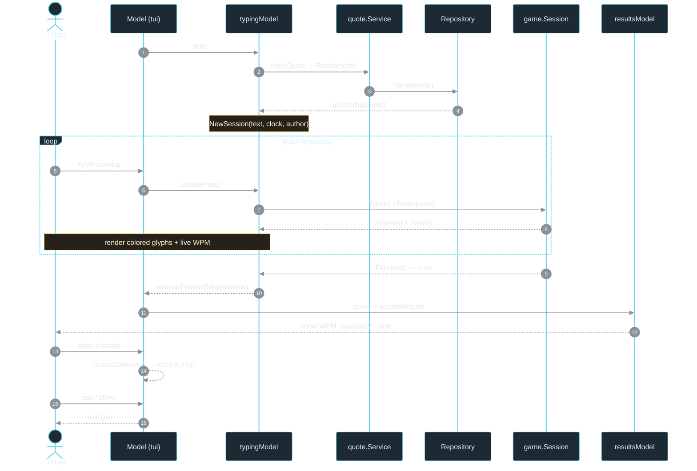
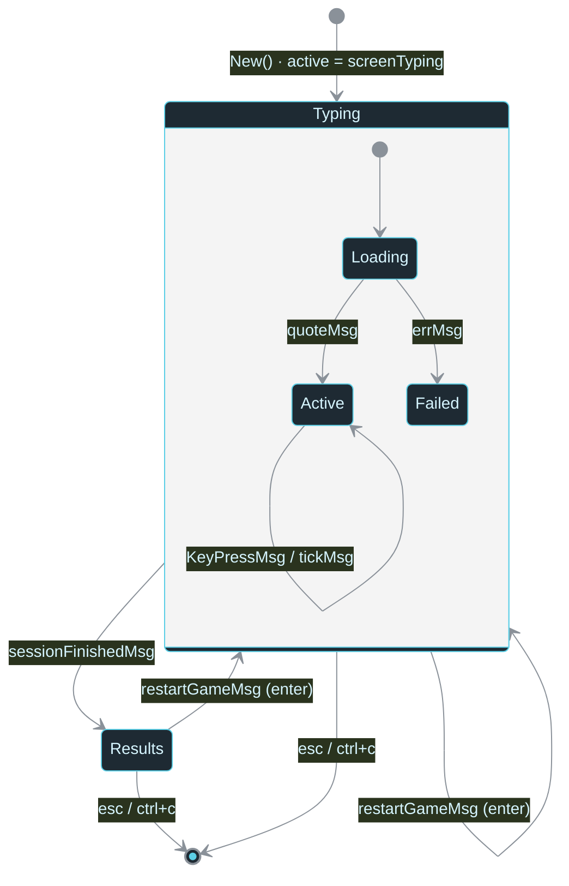

# SpellingGopher — Architecture Diagrams
---

## 1. Package Dependencies & Layers

How the packages wire together, grouped by architectural layer. Arrows point in
the direction of the dependency (caller → callee).

> The **dotted arrows** are the key to the design: infrastructure adapters
> *implement* the `quote.Repository` interface, so the domain never depends on
> a concrete data source. Swapping CSV for the ZenQuotes HTTP API is a one-line
> change in `main`.

---

## 2. Types & Relationships (Class Diagram)

The concrete structs, the interfaces they satisfy, and how they compose.

---

## 3. Runtime Flow — A Full Typing Round

The Bubble Tea event loop, from launch to results and back. Solid lines are
commands/calls; dashed lines are messages flowing back into `Update`.

---

## 4. Screen State Machine

The TUI is a two-state machine switched by messages inside `Model.Update`.

